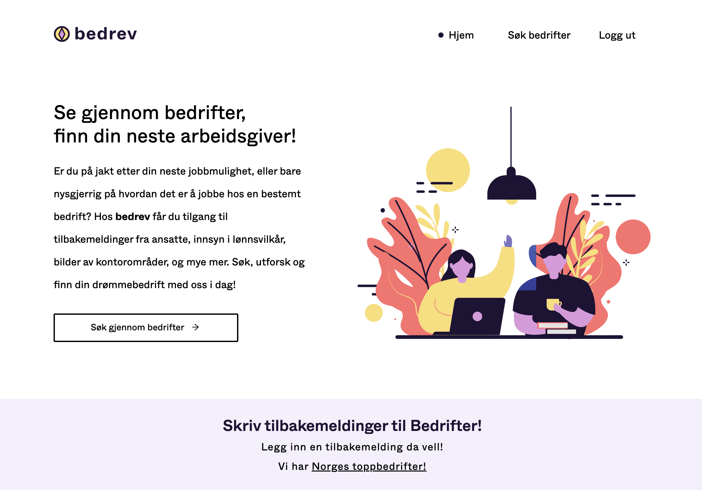
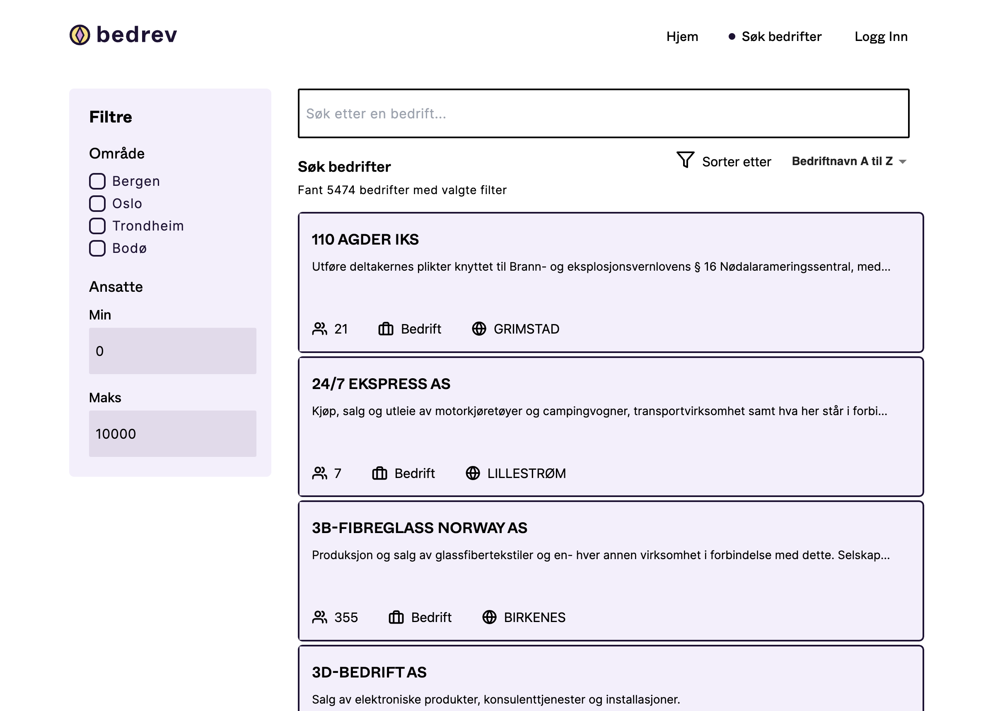
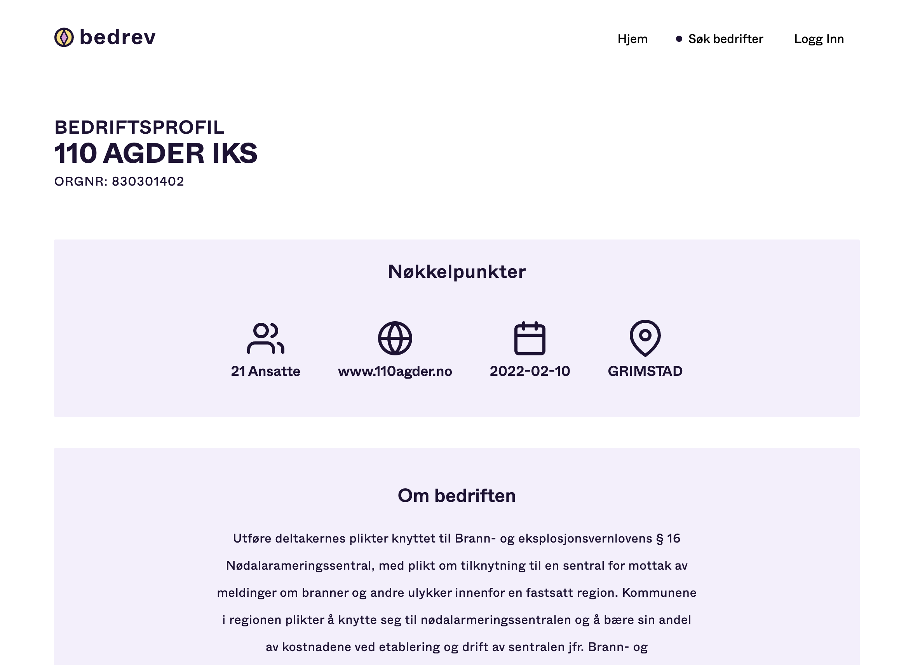

# Bedrev

<div style="width:70%; margin: auto;">

</div>

## Table of Contents

-   [Project 2 - bedrev](#project-2---bedrev)
    -   [Table of Contents](#table-of-contents)
    -   [Description](#description)
    -   [Installation \& Setup](#installation--setup)
        -   [Installation](#installation)
        -   [Backend](#backend)
        -   [Frontend](#frontend)
    -   [Testing](#testing)
    -   [Decisions](#decisions)

## Description

Bedrev is a company review website based in Norway. In which employes can review their company and give it a rating anonymously. Using data from "Brønnøysundregisteret" we can get information about all the companies and display it on the website in a searchable and filterable fashion.

<div style="width:70%; margin: auto;">

</div>

The app comes with search, filter and sort functionality for the dataset. If you also register a new user you can also add a anonymous review to the buisness of your chosing (one review per buisness per user).

<div style="width:70%; margin: auto;">

</div>

## Installation & Setup

As per recommmendation from the instructor "Det er mye enklere for medstudenter å utforske systemet når dere setter opp en kjørende prototyp, samt at de fleste har godt av å ha vært igjennom dette nå" you don't need to install our project locally instead you should go to [the hosted instance](http://it2810-37.idi.ntnu.no/project2/) to see the project in action. The hosted instance will be taken down after the project is graded. If you wish to run the project locally continue reading.

### Installation

To run the app locally follow instructions bellow (_you need to have [Node.js](https://nodejs.org/en/) v20.5+ installed_)

Clone repository:

```
git clone https://gitlab.stud.idi.ntnu.no/it2810-h23/Team-37/prosjekt-2.git
```

### Backend

_This part of the guide takes place in the /backend directory._

The backend consists of an Apollo Server, running with Prisma ORM and GraphQL. We use Postgresql as the actual database.

Full enhetsregister data is available and updated almost daily at [here](https://data.brreg.no/enhetsregisteret/oppslag/enheter/lastned/csv/v2) (a outdated version of the file is available in the repo and requires no further action). However this contains way more data than we need so some collomns get removed in prosecing.To do so make sure the csv you downloaded is in the backend folder and named "fullData.csv" (by default it will have a generated name corresponding to upload date etc)

Since the CSV file was too large, you can download it [here](https://www.mediafire.com/file/q5sdp8i5839kr18/full_data.csv/file).
Place the file in the folder /backend and read the rest of [Backend README](./backend/README.md).

-   Make sure every node package is installed

```
npm install
```

-   Make sure the docker container as defined in "docker-compose.yml" is running to do so have docker and its compose module installed and run, if you don't have docker installed you can find it [here](https://docs.docker.com/get-docker/)

```
docker compose up -d
```

-   Just in case run `npx prisma migrate dev` and click yes to reset the database and enter a name for the migration if required. If this fails make sure the backend/prisma/migrations folder is empty and try again.
-   Then run `node scripts/fixtures.js` to initiate all the date into our table (it might take a while).
-   Then to turn on the backend run `npm start`
-   Enjoy

### Frontend

_This part of the guide takes place in the /frontend directory._

In a separate terminal window do the following:

Install dependencies:

```
npm install
```

Build the app:

```
npm run build
```

Run the app:

```
npm run preview
```

then click on the link given and play around with the app.

## Testing

To run our test suit run `npm run test` in the frontend directory. This will run all the tests in the test suit. For one of the tests the backend needs to be running as it is a end to end test.

## Decisions

To reed further about our decisions and the process of making the app read [decisions.md](./docs/decisions.md).

This includes more info on:

-   The dataset
-   Technologies in use
-   The API
-   Components
-   Styling
-   Testing
